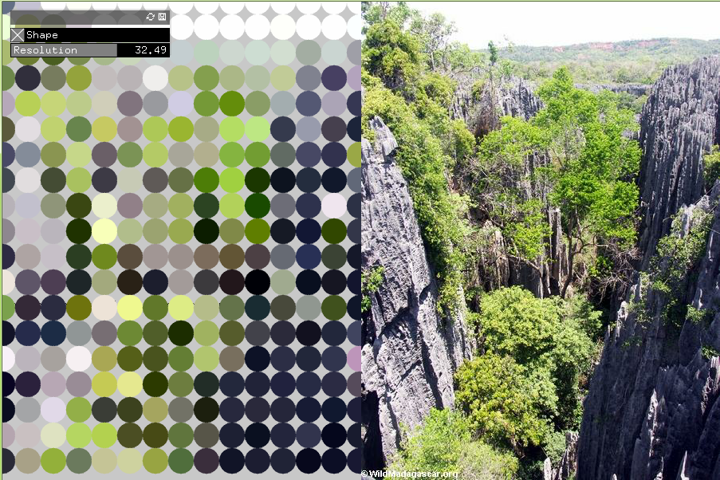
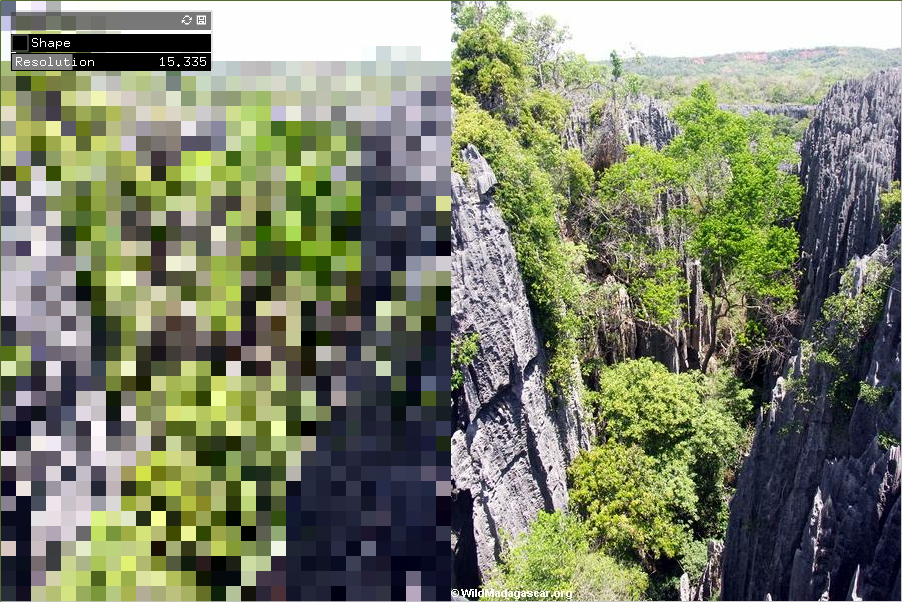

#Web Image Loader with GUI Interface 
###Integrating in a GUI interface 

This piece integrates two of openFrameworks package included examples together to create a web inmage loader with a GUI interface in the form of a button and slider used for toggling between distortion shapes and adjusting the level of distortion itself prespectively. 

######Circle Distortion 

######Square Distortion
